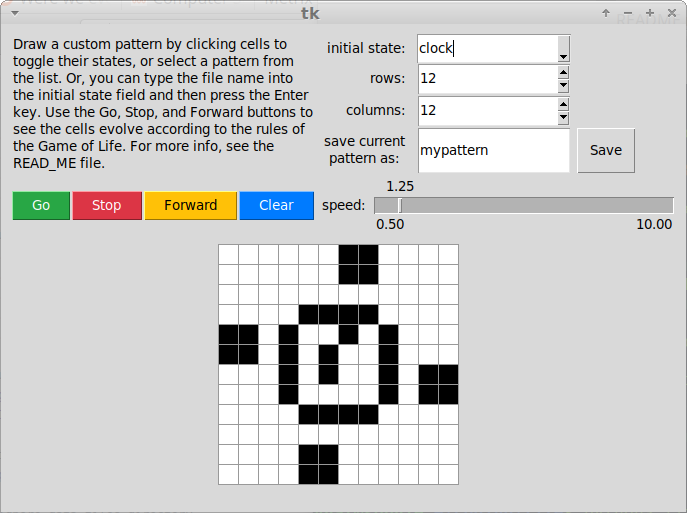
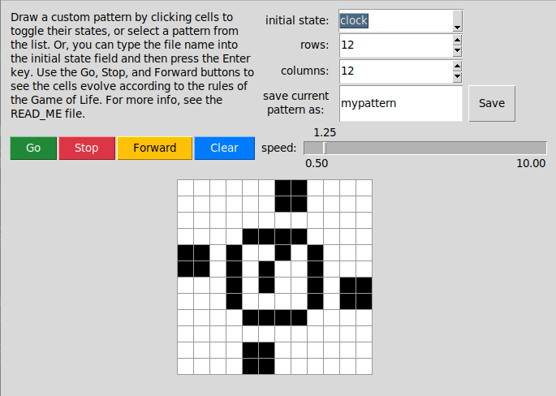

Game of Life
=======

Starting the program
-----------
To start the program, run the file `life.py`. For example,

    python3 life.py

Creating initial patterns
-----------
Draw a custom pattern by clicking cells to toggle their states. You can also select a preset or previously saved pattern from the `initial state` drop-down list. 

If you would like to type in the name of the file instead of selecting from the drop-down list, type the file name and then press the `Enter` key. The `.csv` extension is optional.

Controls
-----------
The dimensions of the grid can be adjusted using the `rows` or `columns` input box. Use the triangular buttons to increment the value up or down. 

Use the `Go`, `Stop`, and `Forward` buttons to see the cells evolve according to the rules of the Game of Life. `Forward` will go forward one generation, and `Go` will animate generations continuously. The speed of the animation can be adjusted with the `speed` slider. `Stop` will stop the animation. 

The `Clear` button will clear all the cells in the grid.

Saving a pattern
-----------
To save the pattern currently displaying in the grid, enter the desired file name in the `save current pattern as` input box and then click the `Save` button. For best results, stop the animation before trying to save. The `.csv` extension is optional and will be automatically added to the saved file name if omitted.

About
-----------
The Game of Life, also known simply as Life, is a cellular automaton devised by the British mathematician John Horton Conway.

The game is a zero-player game, meaning that its evolution is determined by its initial state, requiring no further input. One interacts with the Game of Life by creating an initial configuration and observing how it evolves. 

Game of Life Rules
-----------
The universe of the Game of Life is an infinite, two-dimensional orthogonal grid of square cells, each of which is in one of two possible states, alive or dead, (or populated and unpopulated, respectively). Live cells are black, and dead cells are white. Every cell interacts with its eight neighbours, which are the cells that are horizontally, vertically, or diagonally adjacent. At each step in time, the following transitions occur:

1. Any live cell with fewer than two live neighbours dies, as if by underpopulation.
2. Any live cell with two or three live neighbours lives on to the next generation.
3. Any live cell with more than three live neighbours dies, as if by overpopulation.
4. Any dead cell with exactly three live neighbours becomes a live cell, as if by reproduction.

These rules, which compare the behavior of the automaton to real life, can be condensed into the following:

1. Any live cell with two or three neighbors survives.
2. Any dead cell with three live neighbors becomes a live cell.
3. All other live cells die in the next generation. Similarly, all other dead cells stay dead.

The initial pattern constitutes the seed of the system. The first generation is created by applying the above rules simultaneously to every cell in the seed; births and deaths occur simultaneously, and the discrete moment at which this happens is sometimes called a tick. Each generation is a pure function of the preceding one. The rules continue to be applied repeatedly to create further generations. 

